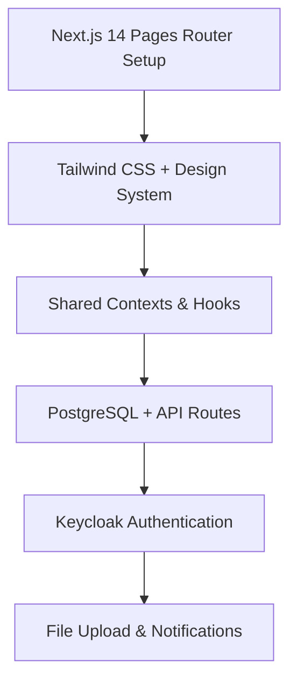

# 🎯 Frontend-First Development Roadmap – Lernplaner

> **Philosophy**: Ship the UI and the real data path together. Every feature must read or write against PostgreSQL so stakeholders always interact with the live product experience.

> 📁 **Hinweis:** Diese Datei beschreibt die empfohlene Reihenfolge für neue Features. Alle Beispiele gehen davon aus, dass die Datenbank mit `npm run db:setup` bereitsteht.

## 🚀 Development Strategy Overview

### Core Principles
1. **Real Data Always**: Components render the actual database records seeded for the default user.
2. **API Contracts First**: Define the Next.js API route before building the UI that consumes it.
3. **Progressive Hardening**: Start with the happy path, then add validation, error states, and analytics hooks.
4. **Stakeholder Feedback**: Demo each sprint with the production data pipeline enabled (no toggles for synthetic data).
5. **Automated Safety Nets**: Pair UI work with Playwright scenarios that exercise the backed endpoints.

### Technology Stack Implementation Order

---

## 📅 Sprint-Based Development Plan

## 🎨 Sprint 1: Visual Foundation Backed by Seed Data (Week 1)
**Goal**: Deliver the dashboard layout reading from `/api/users/:id` and `/api/session-stats` so KPIs reflect the real seeded profile.

### Deliverables
- [ ] Pages router bootstrapped with global layout and Tailwind configuration
- [ ] Dashboard shell with responsive grid and polished cards
- [ ] Gamification summary (level, XP, streak) sourced from `users` table
- [ ] Session counters wired to `session-stats` endpoint
- [ ] Internationalisation baseline (de/en) loaded through `next-i18next`

### Validation Checklist
- ✅ `npm run db:setup` seeds the default user and subjects
- ✅ Visiting `/` renders numbers that match `SELECT * FROM users WHERE id = $1`
- ✅ Lighthouse performance score ≥ 90 on desktop
- ✅ No console warnings or runtime fallbacks

---

## 🎮 Sprint 2: Gamification Mechanics (Week 2)
**Goal**: Implement the XP/state machine fully backed by `/api/gamification/xp` and the `gamification_events` table.

### Deliverables
- [ ] XP gain workflow triggered from the dashboard and session completion
- [ ] Level-up modal with real XP thresholds (`getXPProgress` + DB values)
- [ ] Achievement feed showing unlocked badges from `user_achievements`
- [ ] Toast + audio feedback wired to realtime events
- [ ] Event bus instrumentation persisted to `gamification_events`

### Validation Checklist
- ✅ POST `/api/gamification/xp` updates `users.current_xp` and logs an event
- ✅ Level-up path adjusts `next_level_xp` and unlocks new achievements
- ✅ Playwright spec `tests/tests/gamification-flow.spec.ts` (to add) covers XP, level-up, regression checks

---

## 📚 Sprint 3: Subject Management & Scheduling (Week 3)
**Goal**: Replace all local state traces with CRUD requests to `/api/subjects` and `/api/calendar` so the calendar reflects subject changes instantly.

### Deliverables
- [ ] Subject list + modal backed by POST/PUT/DELETE `/api/subjects`
- [ ] Color picker persists hex code to DB; exam dates update calendar events
- [ ] Calendar month/week/day views sourced from `/api/calendar`
- [ ] Session creation/edit modals commit through `/api/calendar` mutations
- [ ] Calendar stats panel (`DirectCalendarStats`) aggregates live data

### Validation Checklist
- ✅ Deleting a subject cascades to calendar + learning sessions (verify in DB)
- ✅ Drag/drop or modal edits fire `sessionUpdated` event and result in persisted changes
- ✅ Playwright coverage for subject CRUD and calendar scheduling paths
- ✅ `npm run lint` + `npm run type-check` remain clean after schema updates

---

## 📈 Sprint 4: Analytics & Reporting (Week 4)
**Goal**: Deliver `/analytics` with charts powered by `/api/analytics` and `/api/date-specific-stats`, ensuring time ranges reflect actual study behaviour.

### Deliverables
- [ ] Period selector (week/month/year) adjusts API parameters and chart datasets
- [ ] Subject distribution pie chart matches `subjects.completed_hours`
- [ ] Streak view uses recursive query output from `date-specific-stats`
- [ ] KPI banners highlight learning gaps (e.g., completion rate under 60%)
- [ ] Download/export button producing CSV via server route (optional stretch)

### Validation Checklist
- ✅ Analytics API returns populated data for seeded fixtures (non-empty arrays)
- ✅ Charts degrade gracefully when DB tables are empty (no fake values)
- ✅ Stats refresh after session completion without page reload (event bus integration)
- ✅ Automated regression spec comparing API totals with UI totals

---

## 🔄 Continuous Hardening & Ops

### Data Integrity
- Run `npm run db:migrate` on every branch; disallow unchecked test inserts.
- Provide migration scripts for any schema evolution and document breakpoints in `docs/usage.md`.

### Observability
- Centralise logging for API routes (success + error) and trace the active user id for every request.
- Extend Playwright traces to capture network logs for `/api/*` interactions.

### Environment Configuration
- `.env.local` must include `NEXT_PUBLIC_DEFAULT_USER_ID` and `DEFAULT_USER_ID` so the app never falls back to placeholder identifiers.
- Scripts in `/scripts` read those env vars; document expected workflow in `setup/repository-setup.md`.

### Release Cadence
1. `npm run lint && npm run type-check`
2. `npm run build`
3. `npm test` (Playwright)
4. Tag release with changelog summarising user-facing data changes

---

## ✅ Summary
- No synthetic data or placeholders remain—every surface depends on PostgreSQL records.
- Seed scripts (`npm run db:setup`) provide deterministic fixtures for development and CI.
- Event bus + API contracts guarantee the dashboard, calendar, and analytics stay in sync with the same source of truth.
- Future work (Keycloak, file uploads) will reuse the same “data-first” approach defined above.
