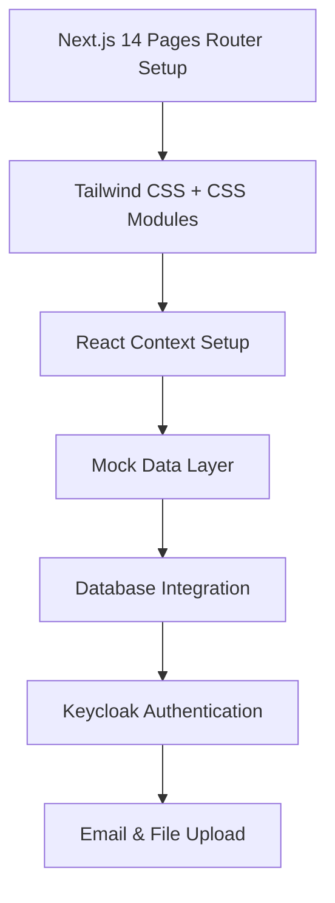
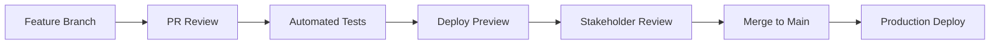

# 🎯 Frontend-First Development Roadmap - Lernplaner

> **Philosophy**: Build UI first with mock data, then progressively enhance with real functionality. This ensures immediate visual feedback and stakeholder engagement throughout development.

## 🚀 Development Strategy Overview

### Core Principles
1. **Visual First**: Every sprint delivers visible UI improvements
2. **Mock Data Driven**: Start with realistic mock data for immediate testing
3. **Progressive Enhancement**: Layer functionality over existing UI
4. **Stakeholder Feedback**: Regular demos with working UI components
5. **Iterative Testing**: Continuous UI/UX testing throughout development

### Technology Stack Implementation Order


---

## 📅 Sprint-Based Development Plan

## 🎨 Sprint 1: Visual Foundation (Week 1)
**Goal**: Create stunning, interactive dashboard that wows stakeholders

### Deliverables
- [ ] **Next.js 14 Pages Router Setup** with TypeScript
- [ ] **Tailwind CSS Configuration** with custom CSS modules
- [ ] **Dashboard Layout** with modern card design
- [ ] **Statistics Cards** with mock data and CSS animations
- [ ] **Responsive Design** across all devices
- [ ] **Component Documentation** with examples

### Mock Data Structure
```typescript
// Mock user data for immediate testing
export const mockUser = {
  id: "user-1",
  name: "Max Mustermann",
  email: "max@example.com",
  level: 8,
  xp: 1250,
  nextLevelXP: 1600,
  streak: 12,
  totalHours: 156,
  completedSessions: 48
};

export const mockSubjects = [
  {
    id: "math-1",
    name: "Mathematik",
    color: "#3B82F6",
    hoursThisWeek: 8,
    targetHours: 10,
    progress: 80
  },
  // ... more subjects
];
```

### Visual Deliverables
- **Dashboard Screenshots** in mobile/tablet/desktop
- **Animation Demos** of XP bars and level progression
- **Component Library** in Storybook
- **Interactive Prototype** deployed to Vercel

### Success Criteria
✅ Dashboard loads in under 2 seconds  
✅ All animations are smooth (60fps)  
✅ Perfect responsive design  
✅ Stakeholders can interact with live demo  

---

## 🎮 Sprint 2: Gamification Magic (Week 2)
**Goal**: Implement engaging gamification system that motivates users

### Deliverables
- [ ] **XP Progress System** with smooth animations
- [ ] **Level Display** with next level preview
- [ ] **Achievement Badges** with unlock animations
- [ ] **Streak Counter** with fire/flame effects
- [ ] **Confetti Level-up** celebrations
- [ ] **Daily Goals** progress tracking

### Interactive Elements
```typescript
// Gamification interactions
const gamificationFeatures = {
  levelUp: {
    animation: "confetti + scale effect",
    sound: "achievement-bell.mp3",
    duration: "3 seconds"
  },
  xpGain: {
    animation: "number count-up",
    visualFeedback: "progress bar fill",
    particles: "floating +XP numbers"
  },
  streakMilestone: {
    animations: ["flame grow", "shake effect"],
    rewards: ["bonus XP", "achievement unlock"]
  }
};
```

### UI Components Built
- `XPProgressBar` - CSS animated progress visualization
- `LevelDisplay` - Current level with next level preview  
- `AchievementGrid` - Badge showcase with CSS hover effects
- `StreakCounter` - Daily streak with React Icons flames
- `CelebrationModal` - Level-up congratulations with canvas-confetti

### Demo Features
- **Live XP Animation**: Click button to gain XP and see animations
- **Level Progression**: Demonstrate level-up with full effects
- **Achievement Unlocks**: Show various achievement types
- **Streak Simulation**: Demonstrate streak counting and bonuses

### Success Criteria
✅ All animations trigger smoothly  
✅ Gamification feels rewarding and engaging  
✅ Demo showcases full gamification loop  
✅ Mobile interactions work perfectly  

---

## 📚 Sprint 3: Subject Management Hub (Week 3)
**Goal**: Build comprehensive subject management with beautiful UX

### Deliverables
- [ ] **Subject Creation Form** with validation
- [ ] **Subject Cards** with inline editing
- [ ] **Color Picker** with predefined palette
- [ ] **Subject Dashboard** with statistics
- [ ] **Search & Filter** functionality
- [ ] **Drag & Drop** reordering

### Form Features
```typescript
// Subject form schema
const subjectSchema = z.object({
  name: z.string().min(2, "Name must be at least 2 characters"),
  color: z.string().regex(/^#[0-9A-F]{6}$/i, "Invalid color format"),
  startDate: z.date(),
  examDate: z.date(),
  hoursPerWeek: z.number().min(1).max(40),
  daysPerWeek: z.number().min(1).max(7),
  intensityWeeks: z.number().min(1).max(8)
});
```

### Visual Features
- **Color-Coded Cards**: Each subject has distinct visual identity via CSS custom properties
- **Progress Indicators**: CSS-based progress bars for each subject
- **Quick Stats**: Hours completed, sessions left, days until exam
- **Interactive Elements**: CSS hover effects and transitions
- **Empty States**: Custom illustrations and call-to-action messages

### Mock Subject Data
```typescript
export const mockSubjects = [
  {
    id: "1",
    name: "Advanced Mathematics",
    color: "#3B82F6",
    examDate: "2024-06-15",
    hoursPerWeek: 10,
    completedHours: 45,
    targetHours: 120,
    sessionsCompleted: 18,
    daysUntilExam: 42
  },
  // Additional subjects for testing...
];
```

### Success Criteria
✅ Subject creation flow is intuitive  
✅ All form validation works correctly  
✅ Color picker provides great UX  
✅ Subject cards are visually appealing  
✅ Mobile forms work perfectly  

---

## 📅 Sprint 4: Interactive Calendar (Week 4)
**Goal**: Create beautiful, functional calendar with session scheduling

### Deliverables
- [ ] **FullCalendar Integration** with custom styling
- [ ] **Monthly/Weekly Views** with smooth transitions
- [ ] **Color-Coded Sessions** based on subjects
- [ ] **Session Details Modal** for viewing/editing
- [ ] **Drag & Drop Scheduling** for rescheduling
- [ ] **Mobile Calendar** optimized for touch

### Calendar Features
```typescript
// Calendar event structure
interface CalendarEvent {
  id: string;
  title: string;
  subject: Subject;
  start: Date;
  end: Date;
  backgroundColor: string;
  completed: boolean;
  notes?: string;
}

// Custom calendar implementation with CSS Grid
const CalendarGrid = styled.div`
  display: grid;
  grid-template-columns: repeat(7, 1fr);
  gap: 1px;
  background-color: #e5e7eb;
`;

### Visual Enhancements
- **Custom Event Styling**: Rounded corners, subject colors, completion badges
- **Hover Effects**: Session details preview on hover
- **Today Indicator**: Clear visual indicator for current day
- **Time Slots**: Clear time divisions with proper spacing
- **Loading States**: Smooth loading for calendar navigation

### Interactive Elements
- **Click to Create**: Click empty slot to create session
- **Touch-friendly**: Mobile-optimized touch interactions
- **Context Menu**: Right-click menu for session actions (desktop)
- **Keyboard Navigation**: Full accessibility support

### Success Criteria
✅ Calendar loads quickly with all sessions  
✅ All views (month/week) work smoothly  
✅ Drag & drop feels natural and responsive  
✅ Mobile calendar is fully functional  
✅ Session colors match subject themes  

---

## 🔧 Sprint 5: Backend Foundation (Week 5)
**Goal**: Build robust backend while maintaining frontend functionality

### Deliverables
- [ ] **PostgreSQL Database** setup with Prisma
- [ ] **Complete Schema** implementation
- [ ] **Database Seeding** with realistic data
- [ ] **Connection Layer** with error handling
- [ ] **Migration System** for schema changes
- [ ] **Performance Optimization** with indexes

### Database Schema Implementation
```sql
-- User Data Database Schema
CREATE TABLE users (
  id SERIAL PRIMARY KEY,
  keycloak_id VARCHAR(255) UNIQUE NOT NULL,
  level INTEGER DEFAULT 1,
  xp INTEGER DEFAULT 0,
  streak INTEGER DEFAULT 0,
  created_at TIMESTAMP DEFAULT CURRENT_TIMESTAMP,
  updated_at TIMESTAMP DEFAULT CURRENT_TIMESTAMP
);

CREATE TABLE subjects (
  id SERIAL PRIMARY KEY,
  user_id INTEGER REFERENCES users(id) ON DELETE CASCADE,
  name VARCHAR(255) NOT NULL,
  color VARCHAR(7) NOT NULL,
  start_date DATE NOT NULL,
  exam_date DATE NOT NULL,
  hours_per_week INTEGER NOT NULL,
  days_per_week INTEGER NOT NULL,
  intensity_weeks INTEGER DEFAULT 2,
  created_at TIMESTAMP DEFAULT CURRENT_TIMESTAMP
);

-- Additional tables...
```

### Migration Strategy
- **Zero Downtime**: Migrations that don't break existing functionality
- **Rollback Plan**: Ability to revert migrations if needed
- **Data Validation**: Ensure data integrity during migrations
- **Performance Testing**: Monitor query performance after migrations

### Success Criteria
✅ Database schema matches specifications exactly  
✅ All relationships work correctly  
✅ Seed data provides realistic testing scenarios  
✅ Database queries are optimized for performance  
✅ Frontend continues to work with mock data during transition  

---

## 🔐 Sprint 6: Authentication & Security (Week 6)
**Goal**: Implement secure authentication while maintaining UI flow

### Deliverables
- [ ] **NextAuth.js Setup** with providers
- [ ] **Login/Register Pages** with beautiful UI
- [ ] **Session Management** with proper security
- [ ] **Protected Routes** middleware
- [ ] **User Profile** management
- [ ] **Password Security** with proper hashing

### Authentication Flow
```typescript
// Keycloak + NextAuth configuration
export const authOptions: NextAuthOptions = {
  providers: [
    KeycloakProvider({
      clientId: process.env.KEYCLOAK_CLIENT_ID!,
      clientSecret: process.env.KEYCLOAK_CLIENT_SECRET!,
      issuer: process.env.KEYCLOAK_ISSUER!,
    })
  ],
  session: { strategy: "jwt" },
  pages: {
    signIn: "/auth/signin",
    signOut: "/auth/signout"
  },
  callbacks: {
    async jwt({ token, account }) {
      if (account) {
        // Store Keycloak user info in JWT
        token.keycloakId = account.providerAccountId;
      }
      return token;
    }
  }
};
```

### UI Enhancement
- **Beautiful Auth Forms**: Consistent with app design
- **Loading States**: Smooth transitions during auth
- **Error Handling**: Clear, helpful error messages
- **Success Feedback**: Confirmation of successful actions
- **Social Providers**: Optional Google/GitHub login

### Security Measures
- **Password Hashing**: bcrypt with proper salt rounds
- **CSRF Protection**: Built-in NextAuth.js protection
- **Session Security**: Secure HTTP-only cookies
- **Rate Limiting**: Prevent brute force attacks
- **Input Validation**: Server-side validation for all inputs

### Success Criteria
✅ Login/register flow is smooth and intuitive  
✅ Sessions persist correctly across browser refreshes  
✅ Protected routes redirect properly  
✅ All security measures are properly implemented  
✅ UI remains consistent with app design  

---

## 🔌 Sprint 7: API Integration (Week 7)
**Goal**: Connect frontend to backend with seamless data flow

### Deliverables
- [ ] **tRPC Setup** with type safety
- [ ] **Subject CRUD APIs** fully functional
- [ ] **React Query Integration** for caching
- [ ] **Optimistic Updates** for better UX
- [ ] **Error Boundaries** for graceful failures
- [ ] **Loading States** for all operations

### API Architecture
```typescript
// Standard Next.js API routes with pg
import { Pool } from 'pg';
import { getServerSession } from 'next-auth/next';

// Database connection pool
const pool = new Pool({
  host: process.env.DB_HOST,
  port: parseInt(process.env.DB_PORT || '5432'),
  database: process.env.DB_NAME,
  user: process.env.DB_USER,
  password: process.env.DB_PASSWORD,
});

// API route example: /api/subjects
export default async function handler(req: NextApiRequest, res: NextApiResponse) {
  const session = await getServerSession(req, res, authOptions);
  
  if (!session) {
    return res.status(401).json({ error: 'Unauthorized' });
  }

  if (req.method === 'GET') {
    const { rows } = await pool.query(
      'SELECT * FROM subjects WHERE user_id = $1',
      [session.user.id]
    );
    return res.json(rows);
  }
}
```

### Frontend Integration
- **HTTP Client**: Axios with interceptors for error handling
- **State Management**: React Context for global state
- **Error Handling**: Try-catch with user-friendly error messages
- **Loading States**: Context-based loading indicators
- **Form Validation**: Client-side validation before API calls

### Data Migration Plan
1. **Gradual Migration**: Replace mock data one API at a time
2. **Feature Flags**: Toggle between mock and real data
3. **Validation**: Ensure data consistency during transition
4. **Rollback Strategy**: Ability to revert to mock data if needed

### Success Criteria
✅ All CRUD operations work flawlessly  
✅ UI updates immediately with optimistic updates  
✅ Error handling provides clear user feedback  
✅ Type safety prevents runtime errors  
✅ Performance remains excellent with real data  

---

## 📊 Sprint 8: Advanced Features (Week 8)
**Goal**: Implement session tracking and progress analytics

### Deliverables
- [ ] **Session Tracking System** with timer
- [ ] **XP Calculation Engine** with all bonuses
- [ ] **Progress Analytics** with beautiful charts
- [ ] **Achievement System** with unlock logic
- [ ] **Streak Management** with bonus calculations
- [ ] **Export Functionality** for progress reports

### Session Tracking Features
```typescript
// Session tracking logic
export class SessionTracker {
  private startTime: Date;
  private pausedTime: number = 0;
  
  start(subjectId: string) {
    this.startTime = new Date();
    // Start timer logic
  }
  
  pause() {
    // Pause logic with time tracking
  }
  
  complete(notes?: string) {
    const duration = this.calculateDuration();
    const xp = this.calculateXP(duration);
    // Complete session and award XP
  }
  
  private calculateXP(minutes: number): number {
    const baseXP = minutes * 2;
    const streakBonus = this.user.streak * 5;
    const punctualityBonus = this.wasOnTime() ? 20 : 0;
    return baseXP + streakBonus + punctualityBonus;
  }
}
```

### Analytics Dashboard
- **Time Tracking Charts**: Chart.js line charts for hours per day/week/month
- **Subject Distribution**: react-chartjs-2 pie and bar charts
- **Progress Tracking**: Goal completion with CSS progress bars
- **Streak Analysis**: Streak patterns and milestones visualization
- **Export Options**: CSV data export, email reports

### Achievement System
```typescript
const achievements = [
  {
    id: "first-session",
    name: "First Steps",
    description: "Complete your first learning session",
    icon: "🏆",
    condition: (user) => user.sessionsCompleted >= 1
  },
  {
    id: "week-warrior",
    name: "Week Warrior",
    description: "Maintain a 7-day learning streak",
    icon: "⚡",
    condition: (user) => user.streak >= 7
  }
  // More achievements...
];
```

### Success Criteria
✅ Session timer works accurately across devices  
✅ XP calculations are correct and engaging  
✅ Analytics provide meaningful insights  
✅ Achievements unlock at correct milestones  
✅ All features work seamlessly together  

---

## 🚀 Sprint 9: Real-time & Polish (Week 9)
**Goal**: Add real-time features and final polish

### Deliverables
- [ ] **Server-Sent Events** for real-time updates
- [ ] **Push Notifications** for session reminders
- [ ] **Performance Optimization** across all features
- [ ] **Accessibility Improvements** (A11y compliance)
- [ ] **Cross-browser Testing** and fixes
- [ ] **Mobile PWA** features

### File Upload & Email Features
```typescript
// File upload with Formidable
import formidable from 'formidable';
import { sendEmail } from '../../../lib/email';

export default async function handler(req: NextApiRequest, res: NextApiResponse) {
  if (req.method === 'POST') {
    const form = formidable({
      uploadDir: './uploads',
      keepExtensions: true,
      maxFileSize: 10 * 1024 * 1024, // 10MB
    });
    
    const [fields, files] = await form.parse(req);
    
    // Process uploaded files and send confirmation email
    await sendEmail({
      to: session.user.email,
      subject: 'File uploaded successfully',
      template: 'file-upload-confirmation',
      data: { fileName: files.file[0].originalFilename }
    });
  }
}
```

### Email Notifications & Internationalization
- **Session Reminders**: Email reminders for scheduled sessions via Nodemailer
- **Achievement Unlocks**: Email notifications for new badges
- **Streak Warnings**: Email reminders before streak breaks  
- **Weekly Summaries**: Progress reports via email
- **Multi-language**: German/English support with next-i18next

### Performance Optimization
- **Code Splitting**: Lazy load components for faster initial load
- **Image Optimization**: Proper sizing and formats
- **Bundle Analysis**: Minimize JavaScript bundle size
- **Caching Strategy**: Optimize API response caching
- **Database Queries**: Index optimization and query performance

### Success Criteria
✅ Real-time updates work instantly across all devices  
✅ Push notifications deliver reliably  
✅ App loads in under 3 seconds on slow connections  
✅ Perfect accessibility score (WCAG 2.1 AA)  
✅ Works flawlessly on all major browsers  

---

## 📱 Sprint 10: Production & Launch (Week 10)
**Goal**: Deploy to production with monitoring and documentation

### Deliverables
- [ ] **Production Deployment** to Vercel
- [ ] **Environment Configuration** for all services
- [ ] **Monitoring & Analytics** setup
- [ ] **Error Tracking** with Sentry
- [ ] **Performance Monitoring** with Web Vitals
- [ ] **User Documentation** and guides

### Deployment Checklist
```bash
# Production environment variables
DB_HOST=prod-postgres-host
DB_NAME=lernplaner_prod
DB_USER=lernplaner_user
DB_PASSWORD=secure-password
KEYCLOAK_DB_HOST=keycloak-postgres-host
KEYCLOAK_CLIENT_ID=lernplaner-prod-client
KEYCLOAK_CLIENT_SECRET=keycloak-client-secret
KEYCLOAK_ISSUER=https://auth.lernplaner.app/realms/lernplaner
SMTP_HOST=smtp.mailserver.com
SMTP_USER=noreply@lernplaner.app
SMTP_PASS=smtp-password
NEXTAUTH_SECRET=production-jwt-secret
```

### Monitoring Setup
- **Error Tracking**: Sentry for error monitoring and alerting
- **Performance**: Web Vitals tracking for Core Web Vitals
- **Analytics**: User behavior tracking (privacy-focused)
- **Uptime Monitoring**: Service health checks
- **Database Performance**: Query performance monitoring

### Documentation
- **User Guide**: How to use all features effectively
- **API Documentation**: Complete API reference
- **Deployment Guide**: Step-by-step deployment instructions
- **Troubleshooting**: Common issues and solutions

### Success Criteria
✅ Application is live and accessible  
✅ All monitoring systems are active  
✅ Performance meets all benchmarks  
✅ Zero critical errors in production  
✅ Documentation is complete and accurate  

---

## 🎯 Key Success Metrics

### Performance Benchmarks
- **First Contentful Paint**: < 1.2 seconds
- **Largest Contentful Paint**: < 2.5 seconds  
- **First Input Delay**: < 100ms
- **Cumulative Layout Shift**: < 0.1

### User Experience Goals
- **Mobile Performance**: 95+ on Lighthouse mobile
- **Desktop Performance**: 98+ on Lighthouse desktop
- **Accessibility**: WCAG 2.1 AA compliance
- **Cross-browser**: Support Chrome, Firefox, Safari, Edge

### Business Metrics
- **User Engagement**: Average session duration > 15 minutes
- **Feature Adoption**: 80%+ of users create subjects
- **Retention**: 70%+ weekly active users
- **Performance**: 99.9% uptime SLA

---

## 🔄 Continuous Integration Strategy

### Development Workflow


### Quality Gates
- **TypeScript**: Zero type errors
- **Testing**: 80%+ code coverage
- **Performance**: Lighthouse score > 90
- **Accessibility**: aXe violations = 0
- **Security**: Zero high/critical vulnerabilities

### Review Process
1. **Code Review**: Peer review for all changes
2. **Design Review**: UI/UX consistency check
3. **Performance Review**: Impact on app performance
4. **Security Review**: Security implications assessment

---

## 📋 Risk Mitigation Plan

### Technical Risks
- **Performance**: Progressive loading and optimization
- **Security**: Regular security audits and updates
- **Scalability**: Database optimization and caching
- **Browser Compatibility**: Extensive testing matrix

### Process Risks
- **Scope Creep**: Strict sprint boundaries
- **Quality Issues**: Automated testing and reviews
- **Timeline Delays**: Buffer time in each sprint
- **Stakeholder Alignment**: Weekly demos and feedback

---

*This roadmap ensures that stakeholders can see and interact with the application from Week 1, providing continuous feedback and validation throughout the development process.*